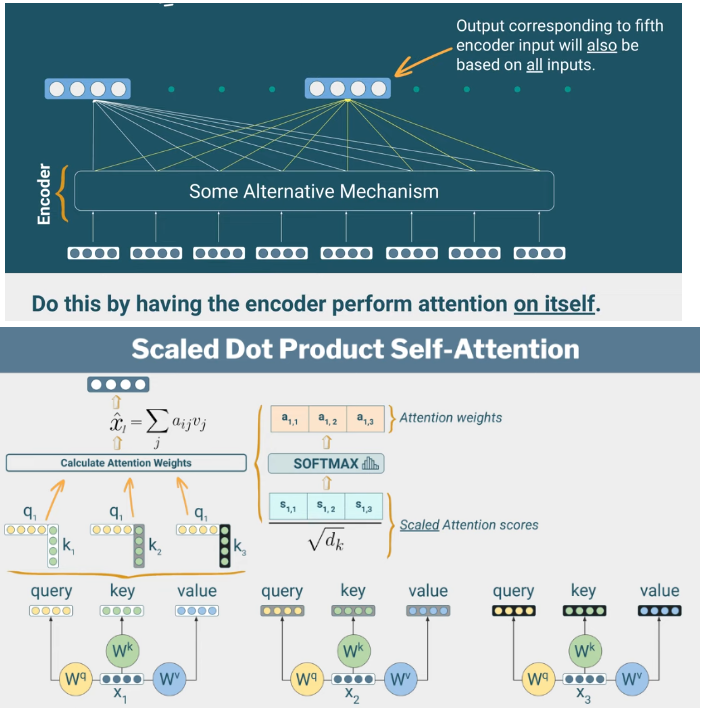
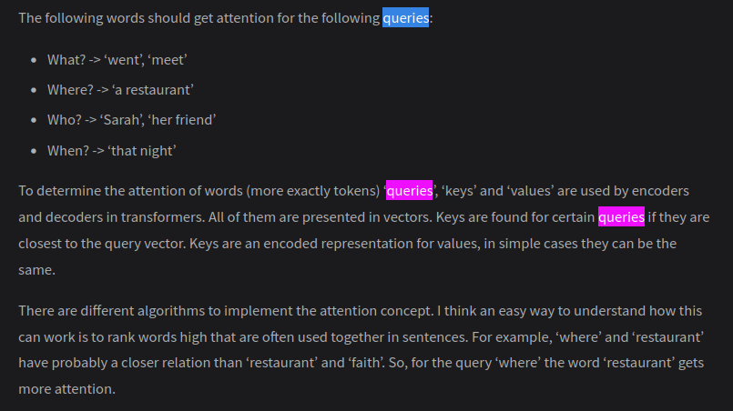
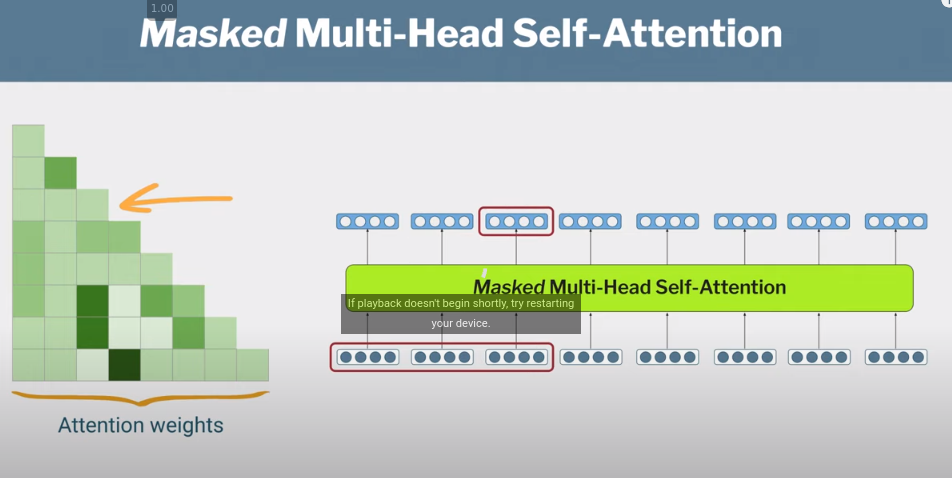

# Transformer architecture

## Brief history

The Transformer architecture was introduced in 2017 in the paper [Attention is all you need](https://arxiv.org/pdf/1706.03762.pdf). 

The advantages of transformers compared to previous SOTA architectures (RNNs, LSTM):

- Parallel processing: Increases performance and scalability 
- Bidirectionality: Allows understanding of ambiguous words and coreferences

## Architecture summary

The original transformer architecture defines two main parts, an encoder and a decoder.

### Encoder
RNN models, the next hidden state is dependent on the calculation on previous ones. So you have to process token by token. This is slow.

In the encoder, tokens are processed in parallel. 

Key characteristics:
- No recurrency
- *Self-Attention*: The [[1708746993-MQOD|attention mechanism]] in the encoder of the transformers architecture is self-attention, where each token can be query, key, and value.
- Hidden state of a timestep is dependent on all others
- *Multi-Head Self-Attention*: An attention head consists of parameters Q, K, and V respectively represent query, key, and value. The motivation to multiple heads is enhanced representation: Longer sequences usually contain verb, adj, multiple relationships, so many things to pay attention to.
    
- The input and output of the encoder is of the same dimension, meaning encoder blocks can be stacked for enhanced representation.
- BERT is encoder-only. GPT is deecoder-only

### Decoder

Key characteristics:
- Training decoders involve [[1708757466-HGNK|teacher forcing]], which comes with pros and cons
- Attention in decoders: there are two.both *Masked Multi-Head Self-Attention* and *Encoder-Decoder Attention* (aka Cross Attention)
  - Masked Multi-Head Attention: During training, the decoder employs masked attention. Only the initial words of the target sentence (usually the ground truth) are provided to the decoder. This prevents the model from "cheating" by looking ahead in the target sequence.

  - Encoder-Decoder Attention (Cross Attention): After masked attention, the decoder uses multi-head attention, similar to what the encoder uses. However, there’s a crucial difference: Input for Cross Attention:
    * The output of the encoder (keys and values) serves as the input for cross attention in the decoder.
    * The queries come from the decoder’s own hidden states.

## Reference

1. [Foundation Models, Transformers, BERT and GPT](https://heidloff.net/article/foundation-models-transformers-bert-and-gpt)
2. [[Future Mojo's guide]]

